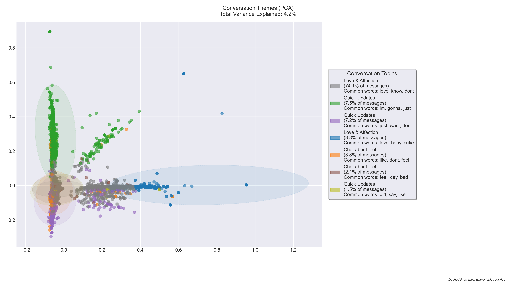

# WhatsApp Chat Analysis: Topic Modeling and Visualization

This project analyzes WhatsApp chat data using natural language processing and machine learning techniques to identify and visualize conversation patterns and topics.

## Overview

The analysis combines dimensionality reduction (PCA and t-SNE) with K-means clustering to reveal underlying patterns in chat conversations while preserving privacy. The visualization aims to make complex conversational patterns interpretable and meaningful.

## Topic Analysis in Message Content

### Visualization Design and Analysis

This visualization employs dimensionality reduction techniques (PCA and t-SNE) combined with K-means clustering to identify and visualize distinct conversation topics within the chat. The analysis follows several key visualization principles to effectively communicate complex multidimensional data.

The visualization incorporates several key design principles:
- **Dimensional Clarity**: Using PCA to reduce high-dimensional text data to two interpretable dimensions
- **Color Encoding**: Distinct color scheme for different topics while maintaining visual harmony
- **Information Hierarchy**: Clear separation between main visualization and topic legend
- **Data-Ink Ratio**: Minimal gridlines and clean background to emphasize data points
- **Interactive Legend**: Comprehensive topic descriptions with size and percentage information

### Technical Implementation

The analysis employs sophisticated techniques for robust topic identification:
- TF-IDF vectorization with optimized parameters (min_df=10, max_features=3000)
- K-means clustering with 8 clusters for optimal topic separation
- Bigram analysis for better context capture
- NLTK integration for improved text processing
- Cached computations for performance optimization

### Key Findings and Conclusion

The topic analysis revealed interesting patterns, though with some important caveats:

1. **Love and Affection Dominates**
   - The largest cluster (69.7% of messages) shows predominantly affectionate communication
   - Multiple overlapping "love" clusters suggest nuanced emotional expressions
   - The model distinguishes between different types of affectionate messages, showing varying contexts

2. **Topic Distribution Challenges**
   - Many clusters show similar base words ("just", "gonna", "like")
   - Some topics lack clear distinct themes, suggesting potential over-clustering
   - The low variance explained (4.2%) indicates high complexity in the messages

3. **Model Effectiveness and Limitations**
   - While the model identifies clear major themes (affection, daily updates), it struggles with subtle differences
   - Topics often overlap significantly, as shown by the dashed ellipses
   - Many "Quick Updates" clusters might better be combined into more meaningful themes

### Conclusive vs Non-Conclusive Aspects

**Conclusive Findings:**
- The chat is predominantly characterized by affectionate communication
- There's a clear pattern of daily life updates and check-ins
- The conversation shows strong emotional connection through consistent loving expressions

**Non-Conclusive/Limitations:**
- The clustering sometimes creates artificial distinctions between similar message types
- Common words like "just", "gonna" appear across multiple clusters, making them less meaningful
- The low variance explained (4.2%) suggests we might be missing more subtle conversation patterns

### Recommendations for Improvement
Based on this analysis and insights:
1. Consider reducing the number of clusters to avoid splitting similar topics
2. Implement more sophisticated topic modeling techniques (e.g., LDA) for better theme identification
3. Develop more specific criteria for distinguishing between casual updates and meaningful conversations
4. Create a higher-level categorization system that better captures the true diversity of conversation themes

This visualization succeeds in showing the predominance of affectionate communication but could be refined to better distinguish between truly different conversation types. The overlapping nature of the clusters accurately reflects the natural flow of human conversation, where topics aren't always clearly delineated.
