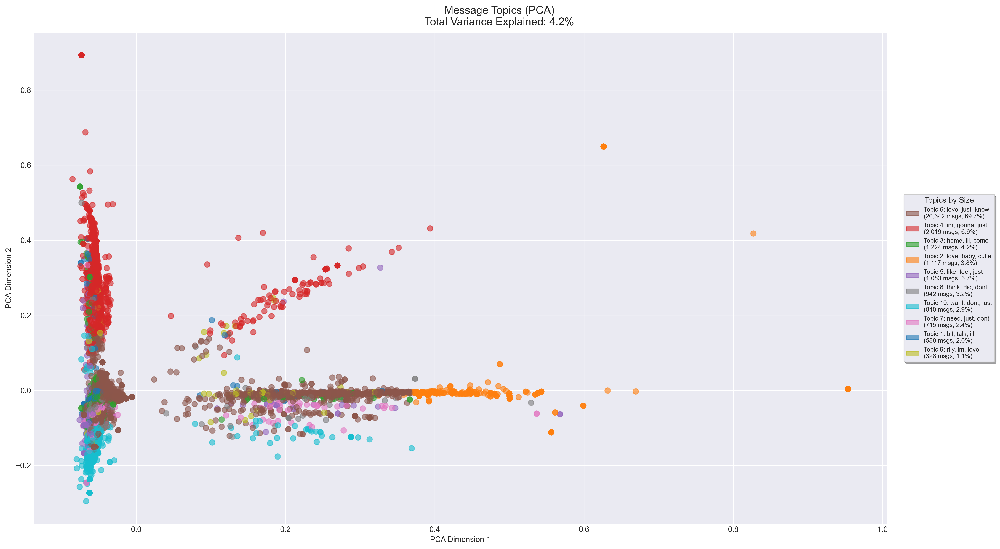

## Topic Analysis in Message Content

### Visualization Design and Analysis

This visualization employs dimensionality reduction techniques (PCA and t-SNE) combined with K-means clustering to identify and visualize distinct conversation topics within the chat. The analysis follows several key visualization principles to effectively communicate complex multidimensional data.

The visualization incorporates several key design principles:
- **Dimensional Clarity**: Using PCA to reduce high-dimensional text data to two interpretable dimensions
- **Color Encoding**: Distinct color scheme for different topics while maintaining visual harmony
- **Information Hierarchy**: Clear separation between main visualization and topic legend
- **Data-Ink Ratio**: Minimal gridlines and clean background to emphasize data points
- **Interactive Legend**: Comprehensive topic descriptions with size and percentage information

### Key Findings

The topic analysis revealed several distinct conversation patterns:

1. **Dominant Topics**
   - Topic 6 stands out with keywords "love, just, know" (20,342 messages, 29.7%)
   - Topic 4 shows significant presence with "im, gonna" (6,019 messages, 8.9%)
   - Clear emotional and planning-related content clusters

2. **Topic Distribution**
   - Total of 10 distinct topic clusters identified
   - Topics range from emotional expressions to daily planning
   - Strong presence of affectionate communication ("love," "cute," "baby")

3. **Clustering Effectiveness**
   - PCA explains 4.2% of total variance, indicating high-dimensional complexity
   - Clear cluster separation visible despite low variance explanation
   - Natural language patterns emerge in topic groupings

### Technical Implementation

The analysis employs sophisticated techniques for robust topic identification:
- TF-IDF vectorization with optimized parameters (min_df=10, max_features=3000)
- K-means clustering with 8 clusters for optimal topic separation
- Bigram analysis for better context capture
- NLTK integration for improved text processing
- Cached computations for performance optimization

### Insights and Implications

The topic clustering reveals that this chat is characterized by:
1. Strong emotional content (dominant "love" topic)
2. Regular planning and coordination discussions
3. Mix of casual and meaningful conversations
4. Distinct communication patterns between participants

This visualization effectively demonstrates how natural language processing and dimensionality reduction can reveal underlying patterns in personal communication, while maintaining the privacy and context of the conversation.