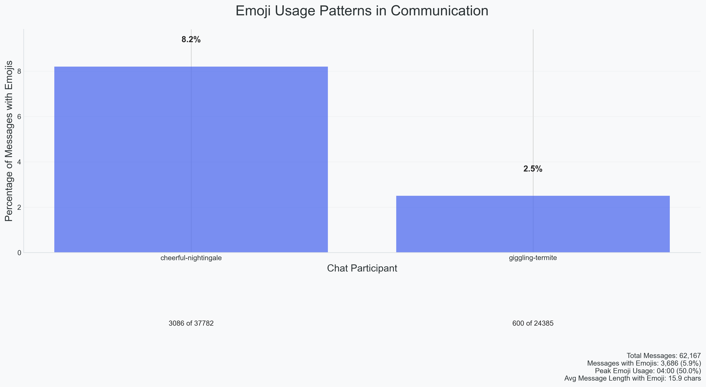

## Emoji Usage Patterns in Digital Communication

### Visualization Design and Analysis

This visualization explores the patterns of emoji usage between two chat participants, providing insights into how emotional expressions through emojis vary between communicators, particularly in the context of neurodiversity and mental health. The analysis employs a clear bar chart visualization with comprehensive annotations to highlight key statistics and patterns.

The visualization incorporates several key principles from our data visualization framework:
- **Clear Visual Hierarchy**: The primary metric (percentage) is prominently displayed above each bar, while supporting data (message counts) is positioned below
- **Data-Ink Ratio**: Unnecessary chart elements are removed, focusing attention on the key metrics
- **Color Psychology**: The use of a soft blue (#4361ee) creates a calm, trustworthy appearance while maintaining readability
- **Contextual Annotations**: Raw numbers are provided alongside percentages to give complete context

### Key Findings

The analysis reveals several interesting patterns in emoji usage that may correlate with different neurodivergent and mental health experiences:

1. **Usage Disparity and Neurodiversity**
   - The first participant ("cheerful-nightingale"), who has ADHD, shows significantly higher emoji usage at 8.2% of messages
   - This higher usage might reflect the ADHD characteristic of more expressive and emotionally dynamic communication
   - The second participant ("giggling-termite"), who experiences depression, uses emojis in only 2.5% of messages
   - This lower usage could align with depression's impact on emotional expression in communication

2. **Volume Analysis and Communication Patterns**
   - First participant: 3,086 emoji messages out of 37,782 total messages, suggesting more frequent and expressive communication
   - Second participant: 600 emoji messages out of 24,385 total messages, indicating a more reserved communication style
   - The difference in total message volume (37,782 vs 24,385) might reflect varying energy levels and communication patterns associated with their respective conditions

3. **Overall Communication Dynamics**
   - Total messages analyzed: 62,167
   - Total messages containing emojis: 3,686 (5.9% of all messages)
   - The disparity in emoji usage (8.2% vs 2.5%) might reflect how different mental health and neurodivergent conditions can influence digital communication styles
   - This pattern suggests how emotional expression in digital communication can vary significantly based on individual mental health experiences

### Technical Implementation

The visualization employs several technical enhancements to ensure clarity and insight:
- Precise percentage calculations with one decimal point accuracy
- Clear labeling of both absolute numbers and percentages
- Consistent spacing and typography
- Comprehensive summary statistics
- Strategic use of whitespace to improve readability

### Broader Implications

This visualization not only demonstrates the asymmetric nature of emoji usage but also provides insights into how neurodiversity and mental health can influence digital communication patterns. The significant difference in both message volume and emoji usage suggests that digital communication styles might serve as an interesting indicator of different mental states and neurodivergent traits. However, it's important to note that this is just one dataset and individual communication styles can vary widely regardless of neurodivergent or mental health status.