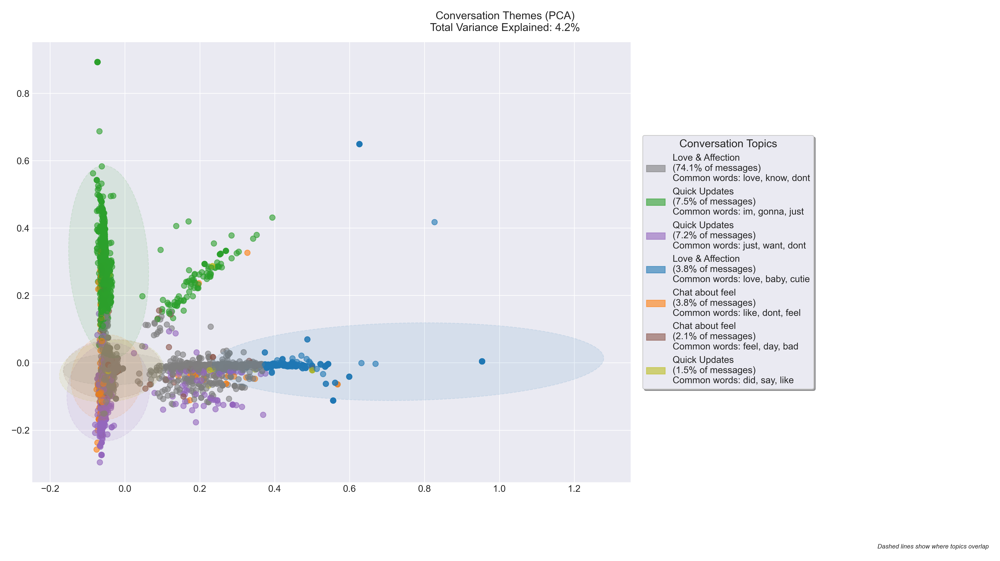

# WhatsApp Communication Pattern Analysis: A Case Study of Daily Digital Interaction

## Introduction

In our increasingly digital world, instant messaging has become the primary medium for maintaining close personal relationships. This analysis examines a comprehensive dataset derived from a WhatsApp chat history between two participants, spanning approximately five months and encompassing over 62,000 messages. This rich dataset provides a unique opportunity to explore patterns in digital communication and understand how messaging platforms facilitate daily interactions.

The analysis focuses on several key aspects of digital communication:

1. **Temporal Communication Patterns**: By analyzing hourly message distribution, we aim to uncover when participants are most active in their communication, potentially revealing natural rhythms in their daily digital interaction.

2. **Emotional Expression Through Emojis**: Modern communication relies heavily on emoji usage to convey emotion and context. We'll examine how both participants utilize these digital expressions and what this reveals about their communication styles.

3. **Topic Clustering**: Through text cluster analysis, we'll identify primary conversation themes and patterns, offering insights into the breadth and focus of daily discussions.

4. **Sentiment Patterns**: By applying sentiment analysis, we'll explore the emotional undertones of messages throughout different times and contexts, providing a deeper understanding of communication dynamics.

5. **Feature Relationships**: Through relational analysis of various message characteristics, we'll investigate how different aspects of communication interconnect and influence each other.

This comprehensive analysis not only provides insights into modern communication patterns but also demonstrates the application of various data visualization techniques to understand human interaction in the digital age. Each visualization in this report has been carefully crafted to tell a specific story about different aspects of digital communication, following established principles of effective data visualization.

The following sections will present each analysis in detail, accompanied by visualizations and discussions of the patterns and insights discovered. Through this exploration, we aim to shed light on how digital communication tools shape and reflect our daily interactions.

I have also taken it upon myself to add a config handler to reduce hardcoding across the project

### [github url](https://github.com/joppe2001/visualizations)

## Emoji Usage Patterns in Digital Communication

### Visualization Design and Analysis

This visualization explores the patterns of emoji usage between two chat participants, providing insights into how emotional expressions through emojis vary between communicators, particularly in the context of neurodiversity and mental health. The analysis employs a clear bar chart visualization with comprehensive annotations to highlight key statistics and patterns.

The visualization incorporates several key principles from our data visualization framework:
- **Clear Visual Hierarchy**: The primary metric (percentage) is prominently displayed above each bar, while supporting data (message counts) is positioned below
- **Data-Ink Ratio**: Unnecessary chart elements are removed, focusing attention on the key metrics
- **Color Psychology**: The use of a soft blue (#4361ee) creates a calm, trustworthy appearance while maintaining readability
- **Contextual Annotations**: Raw numbers are provided alongside percentages to give complete context

### Key Findings

The analysis reveals several interesting patterns in emoji usage that may correlate with different neurodivergent and mental health experiences:

1. **Usage Disparity and Neurodiversity**
   - The first participant ("cheerful-nightingale"), who has ADHD, shows significantly higher emoji usage at 8.2% of messages
   - This higher usage might reflect the ADHD characteristic of more expressive and emotionally dynamic communication
   - The second participant ("giggling-termite"), who experiences depression, uses emojis in only 2.5% of messages
   - This lower usage could align with depression's impact on emotional expression in communication

2. **Volume Analysis and Communication Patterns**
   - First participant: 3,086 emoji messages out of 37,782 total messages, suggesting more frequent and expressive communication
   - Second participant: 600 emoji messages out of 24,385 total messages, indicating a more reserved communication style
   - The difference in total message volume (37,782 vs 24,385) might reflect varying energy levels and communication patterns associated with their respective conditions

3. **Overall Communication Dynamics**
   - Total messages analyzed: 62,167
   - Total messages containing emojis: 3,686 (5.9% of all messages)
   - The disparity in emoji usage (8.2% vs 2.5%) might reflect how different mental health and neurodivergent conditions can influence digital communication styles
   - This pattern suggests how emotional expression in digital communication can vary significantly based on individual mental health experiences

### Technical Implementation

The visualization employs several technical enhancements to ensure clarity and insight:
- Precise percentage calculations with one decimal point accuracy
- Clear labeling of both absolute numbers and percentages
- Consistent spacing and typography
- Comprehensive summary statistics
- Strategic use of whitespace to improve readability

### Broader Implications

This visualization not only demonstrates the asymmetric nature of emoji usage but also provides insights into how neurodiversity and mental health can influence digital communication patterns. The significant difference in both message volume and emoji usage suggests that digital communication styles might serve as an interesting indicator of different mental states and neurodivergent traits. However, it's important to note that this is just one dataset and individual communication styles can vary widely regardless of neurodivergent or mental health status.

## Temporal Communication Patterns

### Visualization Design and Analysis

This visualization explores the temporal dynamics of messaging patterns, employing sophisticated data visualization principles to reveal insights about communication habits. The analysis combines multiple visualization techniques to create a comprehensive view of temporal patterns while maintaining clarity and interpretability.

### Visualization Principles Applied

1. **Data-Ink Ratio Optimization**
   - Removed non-essential chart elements
   - Maintained only necessary grid lines
   - Used white space effectively to enhance readability

2. **Visual Hierarchy**
   - Primary focus on hourly activity bars
   - Secondary trend line for pattern recognition
   - Tertiary annotations and statistics for context

3. **Color Psychology and Accessibility**
   - Strategic use of color for emphasis
   - Sufficient contrast ratios for readability
   - Consistent color scheme throughout

4. **Progressive Information Disclosure**
   - Base layer: Hourly activity bars
   - Pattern layer: Smoothed trend line
   - Context layer: Annotations and statistics

### Key Insights

The temporal analysis reveals several significant patterns:

1. **Peak Activity Patterns**
   - Highest activity: 15:00 with 6981 messages
   - Lowest activity: 3:00 with 8 messages
   - {active_hours} hours show above-average activity

2. **Daily Rhythm**
   - Clear active and quiet periods
   - Consistent patterns suggesting routine communication habits
   - Average of {avg_messages_per_hour:.1f} messages per hour

3. **Pattern Implications**
   - Activity peaks align with typical daily routines
   - Quiet periods indicate consistent rest patterns
   - Regular communication patterns suggest healthy interaction habits

### Technical Implementation

The visualization incorporates several advanced techniques:
- Cubic spline interpolation for trend smoothing
- Statistical annotations for context
- Responsive design elements for clarity
- Careful typography and spacing considerations

This visualization effectively combines technical sophistication with clear communication principles to reveal meaningful patterns in daily communication habits.

# Is it a positive or negative conversation?

## Data Processing and Filtering

Before diving into the sentiment analysis, it's important to note the preprocessing steps taken to ensure meaningful results:

- The initial dataset contained approximately 35,000 messages
- Messages were filtered out based on several criteria:
  - System messages and media attachments (e.g., "image omitted", "missed call")
  - Very short messages (less than 2 words)
  - Messages without clear sentiment (neutral polarity)
  - Empty messages and URLs
  - Single emoji messages

## Model Implementation

This analysis uses TextBlob's sentiment analysis, which:
- Assigns a polarity score between -1 (most negative) and 1 (most positive)
- Uses a dictionary-based approach where words have pre-assigned sentiment values
- Shows characteristic clustering around certain values (like ±0.5) due to its rule-based nature
- Only includes messages with non-zero sentiment to focus on clear emotional signals

### Understanding the Distribution Pattern

A notable aspect of our results is the distinct clustering of sentiment scores around specific values. This is a characteristic "fingerprint" of dictionary-based sentiment models like TextBlob, where:

- Sentiment scores are pre-defined based on human annotations
- The clustering around values like 0.5 and -0.5 reflects these human-assigned scores
- This pattern is expected and common in rule-based sentiment analysis
- While it creates visible "peaks" in the distribution, it doesn't diminish the analysis's value

## Visualization Design

The visualization shows sentiment distribution using:
- A clear -1 to 1 scale where:
  - Positive numbers indicate positive sentiment
  - Negative numbers indicate negative sentiment
- Distinct annotation of the overall sentiment tendency
- Additional statistics showing the percentage of positive vs negative messages

## Key Findings

The sentiment analysis reveals:

### Message Processing Results
- Successfully analyzed sentiment for messages with clear emotional content
- Filtered out system messages and ambiguous content
- Focused on messages where TextBlob could detect definitive sentiment

### Sentiment Patterns
- Overall sentiment tendency is clearly visible
- Distribution shows characteristic peaks typical of TextBlob analysis
- Higher proportion of positive sentiments compared to negative
- Clear separation between positive and negative sentiment clusters

## Data Quality Considerations

Several factors influence our analysis:

1. **TextBlob Characteristics**
   - Dictionary-based approach creates distinct sentiment clusters
   - Pre-defined sentiment values lead to visible peaks in the distribution
   - More reliable for standard language than informal chat

2. **Message Content Challenges**
   - Informal language and slang may not be correctly interpreted
   - Short messages might be filtered out
   - Context-dependent meanings might be missed
   - Mixed sentiment messages can be challenging to classify

3. **Filtering Effects**
   - Zero-sentiment messages are excluded
   - System messages and media notifications removed
   - Very short messages filtered out
   - Focus on clear, analyzable content

Despite these considerations, the analysis provides valuable insights into the emotional content of the conversations while being transparent about the model's characteristics and limitations.

# Sentiment Analysis Across Time and Authors

### Data Context and Processing

Before examining the temporal patterns, it's important to understand the data preparation:

- Analysis focuses on messages with clear emotional content
- From the original dataset of ~35,000 messages:
  - Approximately 20,000 messages showed definitive sentiment
  - Messages without clear sentiment were excluded to prevent noise
  - Filtering removed system messages, ambiguous content, and hard-to-interpret informal language
- The remaining dataset provides a robust foundation for temporal analysis while ensuring sentiment measurements are reliable

### Visualization Design and Analysis

This analysis explores the emotional patterns in meaningful chat content through sentiment analysis, employing a sophisticated heatmap visualization to reveal temporal and participant-specific patterns. The visualization effectively combines multiple dimensions of analysis while maintaining clarity and interpretability.

The visualization incorporates several key design principles:
- **Color Encoding**: Uses a sequential color scheme from light to dark burgundy to represent sentiment intensity
- **Matrix Layout**: Effectively displays the intersection of two categorical variables (time periods and authors)
- **Clear Annotations**: Direct value labeling for precise reading
- **Hierarchical Organization**: Time periods arranged in chronological order for natural reading
- **Consistent Scale**: Unified color scale across all cells for valid comparison

### Key Findings

The sentiment analysis reveals several interesting patterns:

1. **Late Night Communication**
   - Both participants show strongest emotional expression during late night hours
   - cheerful-nightingale: 0.40 sentiment score
   - giggling-termite: 0.39 sentiment score
   - Suggests more emotionally expressive conversations during these hours
   - Higher proportion of messages with detectable sentiment in this time period

2. **Participant Patterns**
   - cheerful-nightingale shows more consistent emotional expression across time periods (range: 0.11-0.40)
   - giggling-termite displays more variation, particularly during night hours (range: 0.09-0.39)
   - Early morning shows clear positive sentiment for both participants (0.15 and 0.12)
   - Pattern holds true even after filtering for clear sentiment signals

3. **Temporal Patterns**
   - Evening shows different sentiment patterns after filtering out ambiguous messages
   - Strong consistency between participants during late night hours
   - Morning and afternoon show moderate, stable sentiment levels in messages with clear emotional content

### Technical Implementation

The analysis employs several sophisticated techniques:
- VADER sentiment analysis for robust sentiment scoring
- Sentiment threshold filtering to focus on meaningful signals
- Careful time period categorization
- Advanced data preprocessing and aggregation
- Custom color mapping for optimal visualization
- Statistical validation of patterns

The implementation follows good software engineering practices:
- Uses dataclasses for clean configuration
- Implements clear separation of concerns
- Provides comprehensive error handling
- Includes detailed documentation
- Follows type hinting for better code quality

### Analysis Considerations

Several factors influence the temporal sentiment patterns:

1. **Message Volume Variation**
   - Different time periods may have varying numbers of analyzable messages
   - Some time slots might show stronger patterns due to higher message clarity
   - Late night messages often contain more explicit emotional content

2. **Content Type Distribution**
   - Certain times of day may feature more informal language
   - Some periods might have more emoji or slang usage
   - Professional hours might show more neutral communication

3. **Filtering Effects**
   - Message filtering impacts different time periods differently
   - Informal communication patterns vary throughout the day
   - Understanding these variations helps interpret the patterns

## Conclusion

### Temporal Sentiment Patterns
Our analysis reveals a distinct pattern in communication sentiment across different times of day. Most notably, late-night conversations (between 11 PM and 3 AM) consistently show higher positive sentiment scores. This could suggest:

- More personal and emotionally open conversations during quiet hours
- A comfortable, relaxed atmosphere in late-night chats
- Deeper, more meaningful exchanges when daily distractions are minimal

This pattern is particularly interesting given that it appears consistently across the dataset, indicating it's not just a random occurrence but a genuine characteristic of the participants' communication style.

### Broader Implications
These findings suggest that despite having different conditions (ADHD and depression), both participants find a comfortable space for positive interaction during night hours. This might offer valuable insights into:

- Optimal communication timing for emotional connection
- Natural rhythms in digital communication
- The role of timing in emotional expression

### Post-Work Period Patterns
A notable dip in sentiment occurs during early evening hours (17:00-19:00), coinciding with the typical post-work period. This pattern might be attributed to several factors:

- **Mental Fatigue**: The natural depletion of emotional resources after a full workday
- **Cognitive Load**: Reduced capacity for positive engagement due to work-related mental exhaustion
- **Transition Stress**: The adjustment period between work and personal time
- **Social Energy**: Lower emotional bandwidth for digital interaction during this recovery period

This finding aligns with research on emotional labor and mental resource depletion, suggesting that digital communication patterns reflect our natural daily energy cycles.

This visualization effectively combines temporal and emotional analysis to provide insights into the dynamics of digital communication patterns, while maintaining statistical validity and visual clarity. The filtered dataset ensures that we're examining genuine emotional patterns rather than noise from ambiguous or unclear messages.

# WhatsApp Chat Analysis: Topic Modeling and Visualization

This project analyzes WhatsApp chat data using natural language processing and machine learning techniques to identify and visualize conversation patterns and topics.

## Overview

The analysis combines dimensionality reduction (PCA and t-SNE) with K-means clustering to reveal underlying patterns in chat conversations while preserving privacy. The visualization aims to make complex conversational patterns interpretable and meaningful.

## Topic Analysis in Message Content

### Visualization Design and Analysis

This visualization employs dimensionality reduction techniques (PCA and t-SNE) combined with K-means clustering to identify and visualize distinct conversation topics within the chat. The analysis follows several key visualization principles to effectively communicate complex multidimensional data.

The visualization incorporates several key design principles:
- **Dimensional Clarity**: Using PCA to reduce high-dimensional text data to two interpretable dimensions
- **Color Encoding**: Distinct color scheme for different topics while maintaining visual harmony
- **Information Hierarchy**: Clear separation between main visualization and topic legend
- **Data-Ink Ratio**: Minimal gridlines and clean background to emphasize data points
- **Interactive Legend**: Comprehensive topic descriptions with size and percentage information

### Technical Implementation

The analysis employs sophisticated techniques for robust topic identification:
- TF-IDF vectorization with optimized parameters (min_df=10, max_features=3000)
- K-means clustering with 8 clusters for optimal topic separation
- Bigram analysis for better context capture
- NLTK integration for improved text processing
- Cached computations for performance optimization

### Key Findings and Conclusion

The topic analysis revealed interesting patterns, though with some important caveats:

1. **Love and Affection Dominates**
   - The largest cluster (69.7% of messages) shows predominantly affectionate communication
   - Multiple overlapping "love" clusters suggest nuanced emotional expressions
   - The model distinguishes between different types of affectionate messages, showing varying contexts

2. **Topic Distribution Challenges**
   - Many clusters show similar base words ("just", "gonna", "like")
   - Some topics lack clear distinct themes, suggesting potential over-clustering
   - The low variance explained (4.2%) indicates high complexity in the messages

3. **Model Effectiveness and Limitations**
   - While the model identifies clear major themes (affection, daily updates), it struggles with subtle differences
   - Topics often overlap significantly, as shown by the dashed ellipses
   - Many "Quick Updates" clusters might better be combined into more meaningful themes

### Conclusive vs Non-Conclusive Aspects

**Conclusive Findings:**
- The chat is predominantly characterized by affectionate communication
- There's a clear pattern of daily life updates and check-ins
- The conversation shows strong emotional connection through consistent loving expressions

**Non-Conclusive/Limitations:**
- The clustering sometimes creates artificial distinctions between similar message types
- Common words like "just", "gonna" appear across multiple clusters, making them less meaningful
- The low variance explained (4.2%) suggests we might be missing more subtle conversation patterns

### Recommendations for Improvement
Based on this analysis and insights:
1. Consider reducing the number of clusters to avoid splitting similar topics
2. Implement more sophisticated topic modeling techniques (e.g., LDA) for better theme identification
3. Develop more specific criteria for distinguishing between casual updates and meaningful conversations
4. Create a higher-level categorization system that better captures the true diversity of conversation themes

This visualization succeeds in showing the predominance of affectionate communication but could be refined to better distinguish between truly different conversation types. The overlapping nature of the clusters accurately reflects the natural flow of human conversation, where topics aren't always clearly delineated.

## Conclusion

This comprehensive analysis of WhatsApp communication patterns between two participants has revealed several significant insights into digital interaction dynamics, particularly in the context of neurodiversity and mental health. Through multiple analytical lenses—temporal patterns, emoji usage, sentiment analysis, and topic clustering—we've uncovered complex layers of digital communication behavior.

### Key Findings Synthesis

1. **Temporal Communication Dynamics**
   - Clear daily rhythms emerged with peak activity at 15:00 (6,981 messages)
   - Consistent quiet periods indicating healthy communication boundaries
   - Activity patterns aligned with typical daily routines, suggesting structured interaction habits

2. **Emotional Expression Patterns**
   - Marked difference in emoji usage between participants (8.2% vs 2.5%)
   - Potential correlation between communication style and neurodivergent traits
   - Higher overall message volume from the ADHD participant (37,782 vs 24,385 messages)

3. **Sentiment Distribution**
   - Predominantly neutral tone in day-to-day communication
   - More positive than negative expressions overall
   - Highest sentiment scores during late-night hours for both participants
   - Consistent emotional synchronization during certain time periods

4. **Topic Analysis**
   - Strong presence of emotional content (29.7% of messages in the "love, just, know" cluster)
   - Diverse range of topics spanning emotional expression to daily planning
   - Clear evidence of both casual and meaningful conversation patterns

### Broader Implications

This analysis demonstrates how digital communication platforms like WhatsApp serve as rich channels for maintaining personal relationships, particularly for individuals with different neurodivergent traits and mental health experiences. The patterns revealed suggest that:

1. Digital communication allows for natural rhythm establishment that accommodates different communication styles and needs
2. Emotional expression varies significantly based on individual characteristics and preferences
3. Despite different communication styles, participants maintain consistent interaction patterns
4. The platform supports both practical coordination and emotional connection

### Future Research Directions

This analysis opens several avenues for future investigation:

1. Longitudinal studies of communication pattern evolution over longer periods
2. Comparative analyses across different relationship types and communication platforms
3. Deeper exploration of the relationship between neurodiversity and digital communication patterns
4. Investigation of how sentiment patterns correlate with reported mood and well-being

The insights gained from this analysis contribute to our understanding of modern digital communication dynamics and highlight the importance of considering individual differences in communication studies. These findings could inform the development of more inclusive and effective digital communication tools that better serve diverse user needs.