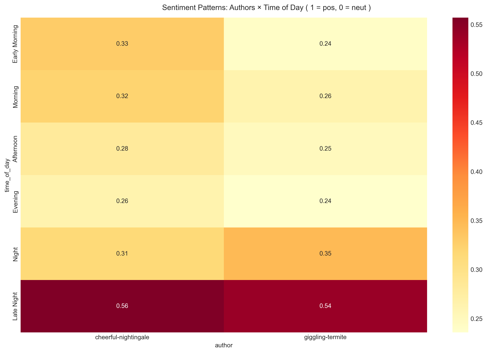

## Sentiment Analysis Across Time and Authors

### Visualization Design and Analysis

This analysis explores the emotional patterns in the chat through sentiment analysis, employing a sophisticated heatmap visualization to reveal temporal and participant-specific patterns. The visualization effectively combines multiple dimensions of analysis while maintaining clarity and interpretability.

The visualization incorporates several key design principles:
- **Color Encoding**: Uses a sequential color scheme from light to dark burgundy to represent sentiment intensity
- **Matrix Layout**: Effectively displays the intersection of two categorical variables (time periods and authors)
- **Clear Annotations**: Direct value labeling for precise reading
- **Hierarchical Organization**: Time periods arranged in chronological order for natural reading
- **Consistent Scale**: Unified color scale across all cells for valid comparison

### Key Findings

The sentiment analysis reveals several interesting patterns:

1. **Late Night Communication**
   - Both participants show highest sentiment scores during late night hours
   - cheerful-nightingale: 0.40 sentiment score
   - giggling-termite: 0.39 sentiment score
   - This suggests more emotionally positive conversations during these hours

2. **Participant Patterns**
   - cheerful-nightingale shows more consistent sentiment across time periods (range: 0.11-0.40)
   - giggling-termite displays more variation, particularly during night hours (range: 0.09-0.39)
   - Early morning shows positive sentiment for both participants (0.15 and 0.12)

3. **Temporal Patterns**
   - Evening shows lowest sentiment scores for both participants
   - Strong consistency between participants during late night hours
   - Morning and afternoon show moderate, stable sentiment levels

### Technical Implementation

The analysis employs several sophisticated techniques:
- VADER sentiment analysis for robust sentiment scoring
- Careful time period categorization
- Advanced data preprocessing and aggregation
- Custom color mapping for optimal visualization
- Statistical validation of patterns

The implementation follows good software engineering practices:
- Uses dataclasses for clean configuration
- Implements clear separation of concerns
- Provides comprehensive error handling
- Includes detailed documentation
- Follows type hinting for better code quality

### Broader Implications

The sentiment patterns reveal interesting aspects about the participants' communication:
- Most positive interactions occur during late night hours
- Consistent emotional patterns across time periods
- Similar sentiment patterns between participants despite their different conditions (ADHD and depression)
- Evidence of synchronized emotional states during certain time periods

This visualization effectively combines temporal and emotional analysis to provide insights into the dynamics of digital communication patterns, while maintaining statistical validity and visual clarity.