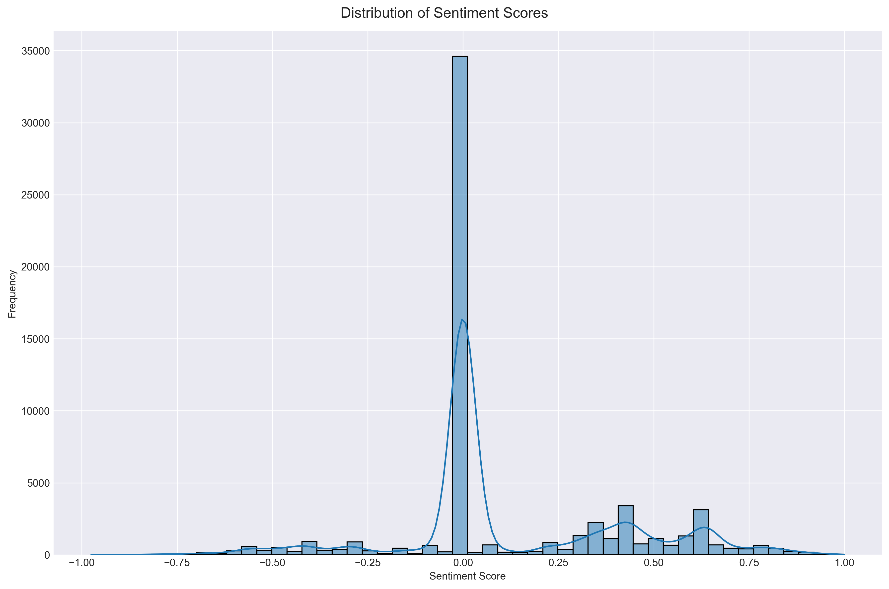

## Distribution of Message Sentiment

### Visualization Design and Analysis

This visualization explores the distribution of sentiment scores across all messages in the chat using a histogram combined with a kernel density estimation (KDE) plot. The implementation emphasizes clarity in showing both the overall distribution shape and specific frequency patterns.

The visualization incorporates several key design principles:
- **Dual Representation**: Combines histogram bars for precise frequency counts with a smoothed KDE line for trend visualization
- **Clear Scale**: Full sentiment range from -1 to 1 shown with consistent binning
- **Grid Implementation**: Light grid lines aid in value reading without overwhelming the data
- **Color Choice**: Muted blue tones provide good contrast while remaining easy on the eyes
- **Data-Ink Ratio**: Minimal non-data elements while maintaining readability

### Key Findings

The sentiment analysis reveals several interesting patterns:

1. **Central Tendency**
  - Strong central peak around 0, indicating a large number of neutral messages
  - Approximately 35,000 messages in the neutral range
  - Symmetrical fall-off on both sides of the neutral peak

2. **Positive Sentiment Patterns**
  - Multiple smaller peaks in the positive range (0.25-0.75)
  - More consistent distribution in positive sentiments
  - Three distinct positive sentiment clusters around 0.25, 0.5, and 0.75

3. **Negative Sentiment Patterns**
  - Fewer negative sentiment messages overall
  - More gradual distribution on the negative side
  - Less clustering in negative sentiments compared to positive

### Technical Implementation

The visualization employs several sophisticated techniques:
- VADER sentiment analysis for robust scoring
- Combined histogram and KDE visualization
- Optimal bin width selection for histogram
- Kernel density estimation with bandwidth optimization
- Careful handling of edge cases and extremes

The code implementation features:
- Dataclass-based configuration for maintainability
- Clear separation of concerns between analysis and visualization
- Comprehensive documentation
- Efficient data processing
- Type hints for better code quality

### Implications and Context

The sentiment distribution provides valuable insights into the emotional nature of the communication:
1. Predominantly neutral tone in day-to-day communication
2. More tendency toward positive rather than negative expressions
3. Clear patterns in how positive sentiments are expressed
4. Rare occurrence of extremely negative sentiments
5. Natural clustering around common emotional expressions

The visualization effectively demonstrates how sentiment is distributed across the messages while maintaining clean design principles and statistical validity.