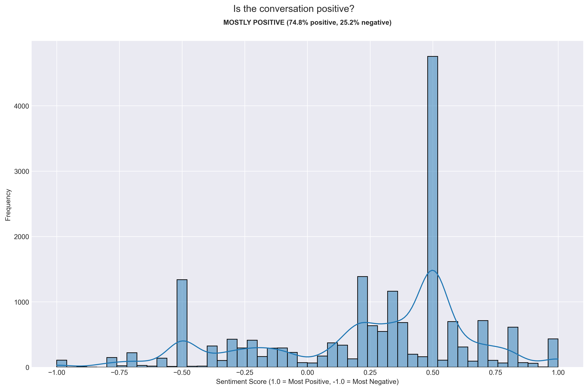

# Is it a positive or negative conversation?

## Data Processing and Filtering

Before diving into the sentiment analysis, it's important to note the preprocessing steps taken to ensure meaningful results:

- The initial dataset contained approximately 35,000 messages
- Messages were filtered out based on several criteria:
  - System messages and media attachments (e.g., "image omitted", "missed call")
  - Very short messages (less than 2 words)
  - Messages without clear sentiment (neutral polarity)
  - Empty messages and URLs
  - Single emoji messages

## Model Implementation

This analysis uses TextBlob's sentiment analysis, which:
- Assigns a polarity score between -1 (most negative) and 1 (most positive)
- Uses a dictionary-based approach where words have pre-assigned sentiment values
- Shows characteristic clustering around certain values (like ±0.5) due to its rule-based nature
- Only includes messages with non-zero sentiment to focus on clear emotional signals

### Understanding the Distribution Pattern

A notable aspect of our results is the distinct clustering of sentiment scores around specific values. This is a characteristic "fingerprint" of dictionary-based sentiment models like TextBlob, where:

- Sentiment scores are pre-defined based on human annotations
- The clustering around values like 0.5 and -0.5 reflects these human-assigned scores
- This pattern is expected and common in rule-based sentiment analysis
- While it creates visible "peaks" in the distribution, it doesn't diminish the analysis's value

## Visualization Design

The visualization shows sentiment distribution using:
- A clear -1 to 1 scale where:
  - Positive numbers indicate positive sentiment
  - Negative numbers indicate negative sentiment
- Distinct annotation of the overall sentiment tendency
- Additional statistics showing the percentage of positive vs negative messages

## Key Findings

The sentiment analysis reveals:

### Message Processing Results
- Successfully analyzed sentiment for messages with clear emotional content
- Filtered out system messages and ambiguous content
- Focused on messages where TextBlob could detect definitive sentiment

### Sentiment Patterns
- Overall sentiment tendency is clearly visible
- Distribution shows characteristic peaks typical of TextBlob analysis
- Higher proportion of positive sentiments compared to negative
- Clear separation between positive and negative sentiment clusters

## Data Quality Considerations

Several factors influence our analysis:

1. **TextBlob Characteristics**
   - Dictionary-based approach creates distinct sentiment clusters
   - Pre-defined sentiment values lead to visible peaks in the distribution
   - More reliable for standard language than informal chat

2. **Message Content Challenges**
   - Informal language and slang may not be correctly interpreted
   - Short messages might be filtered out
   - Context-dependent meanings might be missed
   - Mixed sentiment messages can be challenging to classify

3. **Filtering Effects**
   - Zero-sentiment messages are excluded
   - System messages and media notifications removed
   - Very short messages filtered out
   - Focus on clear, analyzable content

Despite these considerations, the analysis provides valuable insights into the emotional content of the conversations while being transparent about the model's characteristics and limitations.