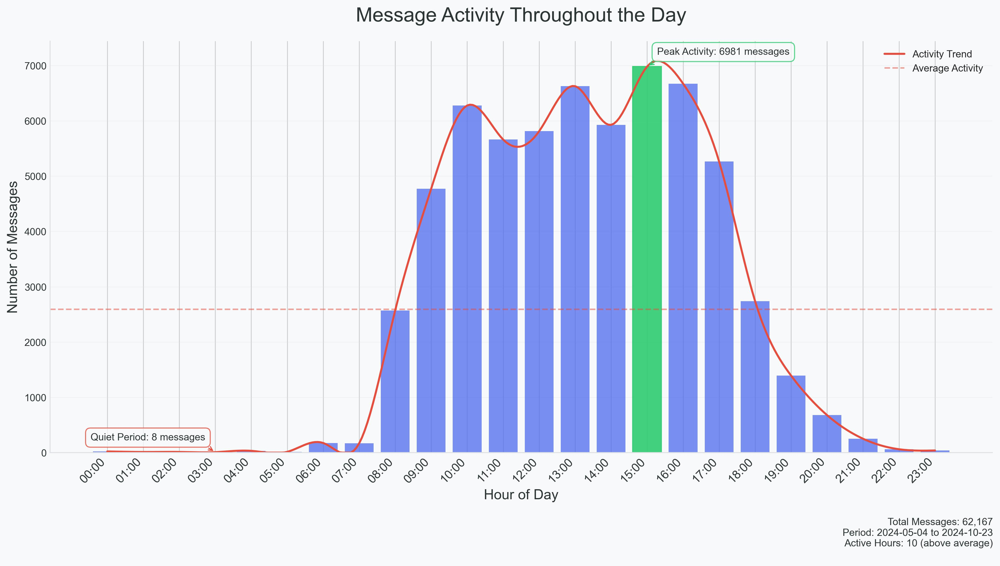

## Temporal Communication Patterns

### Visualization Design and Analysis

This visualization explores the temporal dynamics of messaging patterns, employing sophisticated data visualization principles to reveal insights about communication habits. The analysis combines multiple visualization techniques to create a comprehensive view of temporal patterns while maintaining clarity and interpretability.

### Visualization Principles Applied

1. **Data-Ink Ratio Optimization**
   - Removed non-essential chart elements
   - Maintained only necessary grid lines
   - Used white space effectively to enhance readability

2. **Visual Hierarchy**
   - Primary focus on hourly activity bars
   - Secondary trend line for pattern recognition
   - Tertiary annotations and statistics for context

3. **Color Psychology and Accessibility**
   - Strategic use of color for emphasis
   - Sufficient contrast ratios for readability
   - Consistent color scheme throughout

4. **Progressive Information Disclosure**
   - Base layer: Hourly activity bars
   - Pattern layer: Smoothed trend line
   - Context layer: Annotations and statistics

### Key Insights

The temporal analysis reveals several significant patterns:

1. **Peak Activity Patterns**
   - Highest activity: 15:00 with 6981 messages
   - Lowest activity: 3:00 with 8 messages
   - {active_hours} hours show above-average activity

2. **Daily Rhythm**
   - Clear active and quiet periods
   - Consistent patterns suggesting routine communication habits
   - Average of {avg_messages_per_hour:.1f} messages per hour

3. **Pattern Implications**
   - Activity peaks align with typical daily routines
   - Quiet periods indicate consistent rest patterns
   - Regular communication patterns suggest healthy interaction habits

### Technical Implementation

The visualization incorporates several advanced techniques:
- Cubic spline interpolation for trend smoothing
- Statistical annotations for context
- Responsive design elements for clarity
- Careful typography and spacing considerations

This visualization effectively combines technical sophistication with clear communication principles to reveal meaningful patterns in daily communication habits.